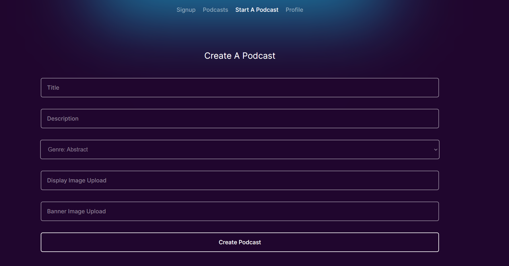

[Link 🎙](https://delicate-frangipane-1b37e2.netlify.app/)
# Podcast App
Podcast Platform developed using `React` and integrated with `Firebase`, `Redux` Toolkit for state management, and Firebase for authentication, storage, and database features. Podcast website is meticulously crafted using cutting-edge technologies to achieve responsive design, login, signup, profile tab , create a new podcast, discover podcasts ,add episodes and genres.

# Screenshots

# Dependencies
* react
* react-router-dom
* firebase
* react-toastify
* reduxjs-toolkit
